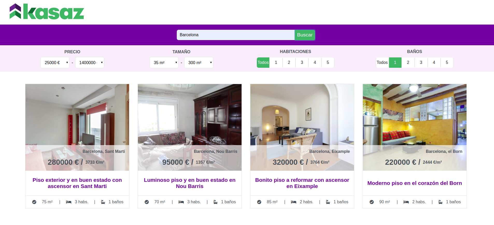
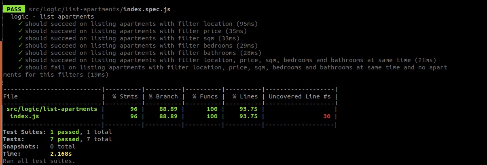
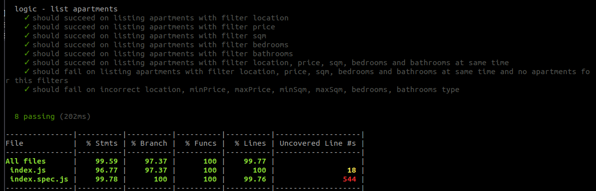

# Kasaz



## Introduction

Kasaz is a simple website to search for apartments.
It's possible to search by location, price, sqm, number of bedrooms or bathdrooms.

You can run the deployed project here: https://diana-moreno.github.io/kasaz

## Technical Description

Frontend: React (javascript), CSS-SASS, BEM, Jest

Backend: Express (Node), Mongoose (MongoDB), Mocha Chai

Others: Git, Github

## Usage

**Prerequisites:**

- Install Node.js if you haven't yet (https://nodejs.org/es/). Npm is needed but is included installing Node.js.

- Install MongoDB (https://docs.mongodb.com/manual/installation/#tutorial-installation).

**Next steps:**

- Download or clone the repository in your local (https://github.com/diana-moreno/kasaz.git).

- Install dependencies from the following folders:
  - kasaz-api
  - kasaz-app
  - kasaz-data
  - kasaz-utils

  running the command in each one:
  ```
  npm i
  ```
- Import the data to the data base. The data is found in 'kasaz-data', so, from this folder run the command:

➜  kasaz-data
  ```
  mongoimport --db=kasaz --collection=apartments --file=apartments-DB.json
  ```

**Running:**

- You need to keep opened 3 terminal windows at the same time.

1- From the folder you have installed the data base MongoDB. Enter in the forlder, and inside of 'bin', run the following command. This keeps your data base on.

➜  bin
  ```
  mongod --dbpath ../data
  ```

2- From 'kasaz-api' you must run the backend with Node:

➜  kasaz-api
  ```
  node .
  ```

3- From 'kasaz-app' your must open the frontend with React:

➜  kasaz-app
  ```
  npm run start
  ```

Now, the data base is on, the server is running and the frontend connected to backend, you can start playing in the website!

## Instructions for testing

**Testing the backend**

From the folder 'kasaz-api', run:

➜  kasaz-api
  ```
  npm run test
  ```
To check test coverage, run:

➜  kasaz-api
  ```
  npm run test:coverage
  ```

**Testing the frontend**

We need to connect the test daba base from the backend, to the frontend test, so is needed to do a litle change in the file '.env' located in the folder 'kasaz-api'.

The folders '.env' are privated and included in '.gitignore' in a real proyect, but, in this project, I didn't included them for accesibility purposes.

Swith the '#' to allow connect to test:

from:
```
DB_URL = mongodb://localhost:27017/kasaz
#DB_URL = mongodb://localhost:27017/kasaz-test
```
to:
```
#DB_URL = mongodb://localhost:27017/kasaz
DB_URL = mongodb://localhost:27017/kasaz-test
```

Run test:
➜  kasaz-app
  ```
  npm run test
  ```

**One finished the mode test, remember to swith another time the '#' to allow the data base connects to the real version, not test.**

To check test coverage, run:

➜  kasaz-app
  ```
  npm run test:coverage
  ```

## Code Coverage

The logic has been tested with a coverage of 96% in frontend and 99.59% in backend.

Frontend coverage


Backend coverage

